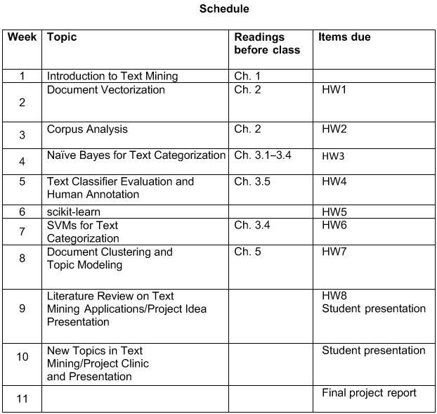

## Ryan Timbrook (Graduate Student - Course Work Repository)
**[LinkedIn Profile](https://www.linkedin.com/in/ryantimbrook/)**

## [Syracuse University, Masters of Applied Data Science](https://ischool.syr.edu/academics/graduate/masters-degrees/ms-in-applied-data-science/)

### IST 736 Text Mining - Fall 2019
### SYLLABUS

                                  **SYRACUSE UNIVERSITY School of Information Studies**
                                           **IST - 736 Text Mining**     

**Prerequisite:**  
IST 687: Introduction to Data Science. The purpose of setting up this prerequisite is to ensure that incoming students have basic programming and algorithmic thinking skills. Exceptions may be given to students who have acquired equivalent skills. 
Audience: Graduate students. 

**Description:**  
Introduces concepts and methods for knowledge discovery from large amounts of text data and the application of text mining techniques for business intelligence, digital humanities, and social behavior analysis. 

**Additional Course Description:**  
The main goal of this course is to increase student awareness of the power of large amounts of text data and computational methods to find patterns in large text corpora. This course is designed as a general introductorylevel course for all students who are interested in text mining. Programming skill is preferred but not required in this class. This course will introduce the concepts and methods of text mining technologies rooted from machine learning, natural language processing, and statistics. This course will also showcase the applications of text mining technologies in: 
* (1) information organization and access
* (2) business intelligence
* (3) social behavior analysis
* (4) digital humanities. 

**What is the difference between IST 565 Data Mining and IST 736 Text Mining?** 
 
A number of students have asked the question, “What is the main difference between the two courses: data mining and text mining?” The two classes share the theoretical foundation in machine learning. Therefore, the fundamental concepts in machine learning, such as classification and clustering, are covered in both classes. However, these two classes differ in the following aspects: 

* **Content wise:** The data mining class focuses on structured data, meaning the data sets we play in the class are usually in .csv format. Text mining focuses on unstructured text data, which come in words. How to convert text to numbers that still bear the meaning of text is an important topic in text mining. In text mining we will have to deal with some problems that do not exist in mining structured data, such as the subjectivity in annotations, for example, how to determine if a tweet is positive, negative, or neutral. Different people might give different assessments. 

* **Technology wise:** The data mining class uses Weka and R. The text mining class uses a Python-based command line tool call scikit-learn.

* **Challenge wise:** Text mining requires even more critical thinking as it is research oriented. The students are usually a mix of doctoral and masters students from multiple disciplines, such as iSchool, linguistics, communications, business, political science, etc. 

**What is the difference between IST 736 Text Mining and IST 664 Natural Language Processing?**  
NLP and TM do share some foundations. NLP focuses on deep analysis of language, such as POS tagging, sentence structure parsing, named-entity recognition, semantic role labeling, etc. Deep analysis can be highly informative and also time consuming. In contrast, text mining focuses on using machine learning and large amounts of data for fast predictions, usually on shallow features like just words. Depending on real-world applications, sometimes we need deep analysis if time is not a concern, sometimes we do fast and shallow analysis, and sometimes combine both. IST 664 is not a prerequisite for IST 736. 
 
**Learning Objectives:** After taking this course, the students will be able to: 
* describe basic concepts and methods in text mining, for example document representation, information extraction, text classification and clustering, and topic modeling; 
* use benchmark corpora, commercial and open-source text analysis and visualization tools to explore interesting patterns; 
* understand conceptually the mechanism of advanced text mining algorithms for information extraction, text classification and clustering, opinion mining, and their applications in real-world problems; and 
* choose appropriate technologies for specific text analysis tasks and evaluate the benefit and challenges of the chosen technical solution. 

Course Schedule:

[SYRACUSE UNIVERSITY School of Information Studies](https://ischool.syr.edu/)
